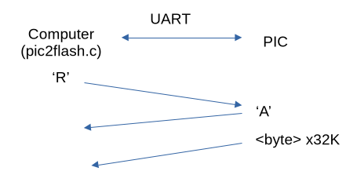
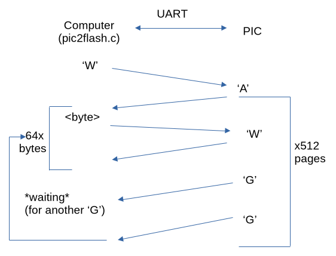

# pic2flash

A little personal project to flash the 29C family of flash chips (speciffically the 29C256 because it is phisically wired that way, for now) using a PIC microcontroller.

# \*THIS IS A WORK IN PROGRESS\*

At the moment the project has some major bugs that prevent it from functioning at all and that I need to find and solve but it's close to being finished. 

# Description

I was working on my Z80 breadboard computer and didn't have a flash programmer. I was staring at an unused PIC16F917 on my desk and thought that I should just make the flash programmer myself.

The basic principle is that the PIC receives the bytes over UART from a computer (through a usb to UART adapter) using its dedicated AUSART module then puts them on the 8 bit address bus connected to PORTD (respecting the timing, waiting between pages and disabling then re-enabling the software write protection). The address bus (connected on PORTA[0-7] and PORTB[0-6]) is automatically counted by the PIC without any input from the computer.

The project consists of 2 parts: the C program (pic2flash.c) which is the computer side of things and the assembly program for the PIC itself. The C program is a bit slopy as I didn't spend that much time on it so it might have some bugs which I will probably fix. Also the C program works only on *nix operating systems due to how it opens files and the UART tty.

# Protocol

At power up the PIC waits for the character 'R' (for reading) or 'W' (for writing) from the computer.

If it receives the character 'R' it sends the character 'A' as an acknowledgement after which it sends all 32K bytes from the chip which the computer saves to a file of your choosing.

Crude READ diagram:

If it receives the character 'W' it sends the character 'A' as an acknowledgement so that the computer knows it needs to send the bytes. The computer starts sending bytes and after each byte the PIC sends back a W to signal that it's ready for the next one then once 64 bytes have been received the PIC sends a 'G' to signal that the page has ended and a little time is needed for the flash to complete the write operation, in this time the computer waits and the PIC constantly polls the device to see if it finished writing then sends another 'G' to tell the computer to continue sending the rest of the bytes. This is repeated for 32K bytes in 64 byte pages.

# License

This code is licensed under the MIT NON-AI License which can be found here:  
<a href="https://github.com/non-ai-licenses/non-ai-licenses"> https://github.com/non-ai-licenses/non-ai-licenses </a>  
Credit to <a href="https://github.com/axel22"> axel22 </a>.

